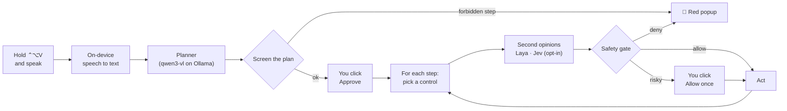

<p align="center">
  
</p>

<h1 align="center">Glim</h1>

<p align="center">
  <b>A glimmer in your notch that runs your Mac — safely.</b><br>
  Hold <kbd>⌃</kbd><kbd>⌥</kbd><kbd>V</kbd>, say what you want, approve the plan, and watch it happen.<br>
  Local AI. Native Swift. A kill switch that works even when the app freezes.
</p>

---

## What Glim is

Glim is a personal voice assistant for your Mac. It reads the screen, opens apps, clicks,
types and arranges windows — using an AI model that runs **on your Mac** through Ollama.

It is built around one rule:

> **The AI proposes. Code decides. You approve.**

The model never touches your Mac. It can only *suggest* steps; every suggestion passes a safety
gate written in plain, tested Swift, and nothing runs until you click **Approve**.

## Try saying

| You say | Glim does |
|---|---|
| "Open Notes and write buy milk" | Shows a 3-step plan → you approve → opens Notes, clicks New Note, types "buy milk" |
| "What's on my screen?" | Reads the window and answers aloud — no actions |
| "Put Notes on the left, Safari on the right and minimize Slack" | Arranges your windows in one approved plan |
| "Play music" | Opens Music and presses play |
| "Delete this note" | 🚫 Blocked — deleting is forbidden, and a red popup says why |
| "Stop" | Stops everything |

## How it works



The planner only ever sees **labels** — app names, window titles and the names of buttons,
fields and list rows — never the contents of your documents, emails or fields, so text inside
them can't sneak steps into a plan. (A list row's label is the words it shows, so a message
preview title can appear.)

## Safety

Every app has a trust tier. New apps start read-only.

| Tier | What Glim may do | Examples |
|---|---|---|
| 🚫 **Never-touch** | Nothing — not even open or read it | Passwords, Keychain, AnyDesk, iPhone Mirroring, security prompts, Glim itself |
| 👀 **Read-only** | Open, switch, read, move and minimize windows | Terminal, browsers, System Settings, every unlisted app |
| 🧑‍✈️ **Supervised** | Click and type — but every step asks you | VS Code, Cursor, Xcode, Claude, ChatGPT |
| ✅ **Full control** | Runs the plan you approved; risky steps ask | Notes, TextEdit, Calendar, Music, Mail, Messages, Slack |

On every step the gate checks, in order: kill switch · watchdog · tier · same action and app as
approved · the control is really on screen · not a password field · the exact approved text,
no line breaks · limits · forbidden words (delete, buy, sign out, allow, don't save…). Risky
words (send, submit, reply…) and pressing Return always ask you.

Full details in **[docs/SAFETY.md](docs/SAFETY.md)**.

### The kill switch

- Press <kbd>⌃</kbd><kbd>⌥</kbd><kbd>⌘</kbd><kbd>K</kbd> anywhere
- Click ■ in the pill or **STOP** in the menu
- Say "stop" while holding the talk key
- **Just touch your keyboard or mouse** while Glim is acting

⌃⌥⌘K belongs to a separate tiny watchdog process. If Glim freezes, the watchdog force-quits it
within half a second. Last resort: Force Quit (⌥⌘⎋) or `pkill -x Glim`.

## What leaves your Mac

**Nothing** — unless you switch on the optional Jev checker. Speech is recognized on the Mac,
the planner runs in local Ollama, the Laya checker runs locally, screenshots stay in memory.
Glim's network allowlist is enforced in code: `127.0.0.1` only, plus TypeSafe's Jev address if
you turn Jev on (then your goal, app name, window title and the candidate controls' labels are
sent — never screenshots, never the text you're typing, never messaging apps). Cloud AI models
are refused, even through the local Ollama address.

## Quick start

Requirements: Apple Silicon Mac, **macOS 26**, Xcode 26.

```sh
# 1. The planner model (Ollama 0.6.x is too old for qwen3-vl)
brew upgrade ollama
brew services start ollama
ollama pull qwen3-vl:8b        # ~6 GB; qwen3-vl:4b is lighter

# 2. Optional: the local Laya checker (read services/laya/README.md first)
scripts/start-laya.sh

# 3. Build and open Glim (and the practice app)
scripts/run.sh --testbed
```

4. **Grant permissions** when asked, or from **Control Panel → Permissions**: Microphone,
   Speech Recognition, Accessibility, and Screen Recording (only needed for the screenshot
   fallback).
5. **Practice on Testbed first** — see [docs/manual-tests.md](docs/manual-tests.md).

`scripts/build-app.sh` signs with your Apple Development identity when you have one. That keeps
permission grants across rebuilds, and lets Glim trust Testbed (ad-hoc-signed apps are always
read-only).

## Using Glim

| Pill | Meaning |
|---|---|
| 〰️ cyan | Listening — your words appear as you speak |
| ◌ purple | Planning |
| ✋ orange | Waiting for you in a panel |
| ⚡ green | Acting: "2/3 Click “New Note” in Notes" — ■ stops |
| ✓ | Done |
| 🛑 red | Stopped — the popup and the Activity Log say why |

The **control panel** (menu bar → Open Control Panel) has a live Dashboard, **Apps & Trust**
(drag apps between tiers), **Safety Rules**, **AI Models**, **Permissions** and the
**Activity Log**. Making anything less safe asks for Touch ID.

## Development

```sh
scripts/check.sh     # build → 314 tests → strict swift-format lint (the gate)
scripts/format.sh    # apply house style
```

- Swift 6 language mode, strict concurrency, **zero third-party packages**.
- `GlimCore` holds all logic behind protocols and is tested with fakes (Swift Testing).
  `Glim`, `GlimWatchdog` and `Testbed` are thin executables.
- Built test-first; every step is recorded in [docs/build-log.md](docs/build-log.md).

```
Sources/GlimCore/   Actions · Trust · Safety · Screen · Model · Checkers · Network
                    Voice · Execution · Runner · Settings · Watchdog · Logging · Presentation
Sources/Glim/       menu bar app: AppModel, NotchPill, Panels, ControlPanel, Services
Sources/GlimWatchdog/   the ⌃⌥⌘K helper
Sources/Testbed/    the practice app
```

## Documents

| | |
|---|---|
| [Design spec](docs/specs/2026-09-23-design.md) | What Glim is and why |
| [Every design question and answer](docs/decisions/2026-09-23-design-questions-and-answers.md) | How each decision was made |
| [Implementation plan](docs/plans/2026-09-23-plan.md) | The task roadmap |
| [Build log](docs/build-log.md) | What was built, step by step, with real output |
| [Safety](docs/SAFETY.md) | The safety model in plain words |
| [Manual tests](docs/manual-tests.md) | The script to prove it on your Mac |

## Uninstall

```sh
pkill -x Glim
rm -rf build/Glim.app ~/Library/Application\ Support/Glim
security delete-generic-password -s dev.straxs.Glim.settings-seal
security delete-generic-password -s dev.straxs.Glim.jev     # only if you saved a Jev key
tccutil reset All dev.straxs.Glim                            # revokes Glim's permissions
```

## FAQ

**Why isn't Glim sandboxed?** macOS's App Sandbox blocks the Accessibility API, which is the only
way to click and type in other apps. Safety is enforced in code instead: typed actions only, no
shell or scripts, a network allowlist, and the gate.

**Why did it ask me to confirm?** The panel lists every reason: a risky word, pressing Return, a
button that doesn't match the plan, a checker that disagreed or is offline, or a supervised app.

**Why can't it click in my browser?** Browsers are read-only: web pages are the most common place
for text that tries to trick an AI. You can change that in Apps & Trust (with Touch ID).

**Can it delete files or run commands?** No. There is no code in Glim that can.

## Credits

Laya decision model by Convai Innovations, and `localdecide` by ChenneyZhuang (both Apache-2.0).
Qwen3-VL via Ollama. Built with Apple's SpeechAnalyzer, Accessibility, ScreenCaptureKit and
SwiftUI.
