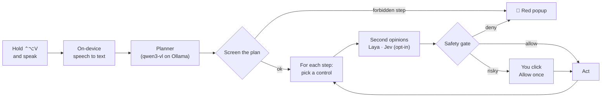

<p align="center">
  
</p>

<h1 align="center">Glim</h1>

<p align="center">
  <b>A glimmer in your notch that runs your Mac — safely.</b><br>
  Hold <kbd>⌃</kbd><kbd>⌥</kbd><kbd>V</kbd>, say what you want, and watch it happen — anything risky asks you first.<br>
  Local AI. Native Swift. A kill switch that works even when the app freezes.
</p>

---

## What Glim is

Glim is a personal voice assistant for your Mac. It reads the screen, opens apps, clicks,
types and arranges windows — using an AI model that runs **on your Mac** through Ollama.

It is built around one rule:

> **The AI proposes. Code decides. You approve.**

The model never touches your Mac. It can only *suggest* steps; every suggestion passes a safety
gate written in plain, tested Swift. Plans start at once; Glim asks only before a dangerous step
(send, Return, quitting, a supervised app), and forbidden steps are always blocked.

## What's new

- **A new orb.** Glim's orb is now a sphere of flowing light: colours drift inside a liquid
  edge that ripples with your voice, under a glossy highlight, with a turning aura behind it.
  Each state has its own palette. The app icon and the animation above show it.
- **Works in Chromium apps.** Spotify, Slack, VS Code, Cursor and other Electron and
  Chromium-based apps hide their controls from macOS until asked. Glim now wakes them with
  the right switch for each kind of app, waits for their controls to appear, and leaves native
  apps untouched.
- **Faster.** When exactly one control matches the plan's wording, Glim clicks it without
  asking the model. Otherwise the model sees a shortlist of the 20 closest controls, which cut
  one pick from 13.5 s to 3.8 s on an M2. Planning lists only the controls your request is
  about.
- **Clearer stops.** Instead of "the AI failed 3 times", Glim says what happened: the button
  is greyed out, the window shows no controls, the control changed before it could act (and
  what changed), or the plan tried to click a window's close button.
- **Read check.** Apps & Trust → **Check open apps** reads every open app's window, the way a
  task would, and shows how many controls Glim can see in each.
- **Laya training.** Teach the local Laya checker your Mac apps: Glim can save the steps Laya
  checked (off by default, on your Mac only, password-like words hidden). You review them, and
  `scripts/train-laya.sh` trains and promotes a better checkpoint on your Mac with MLX.
- **Timing in the Activity Log.** Every plan and step logs where its time went (read window,
  pick, check, act), so a slow step shows its bottleneck.

## Try saying

| You say | Glim does |
|---|---|
| "Open Notes and write buy milk" | Just runs: opens Notes, clicks New Note, types "buy milk" |
| "What's on my screen?" | Reads the window and answers aloud — no actions |
| "Put Notes on the left, Safari on the right and minimize Slack" | Arranges your windows in one plan |
| "Play music" | Opens Music and presses play |
| "Minimize Slack" · "Quit Spotify" | Uses Glim's own window and app actions — never a window's red button |
| "Delete this note" | 🚫 Blocked — deleting is forbidden, and a red popup says why |
| "Stop" | Stops everything |

## How it works



The planner only ever sees **labels** — app names, window titles and the names of buttons,
fields and list rows — never the contents of your documents, emails or fields, so text inside
them can't sneak steps into a plan. (A list row's label is the words it shows, so a note or
message title can appear. Labels stay on your Mac, and Glim hides password-like words before
it writes any to the Activity Log or keeps them for training.)

### Which apps it works in

| App kind | Examples | How Glim reads it |
|---|---|---|
| Native Mac apps | Notes, Mail, Calendar, Music, Finder, Xcode | Directly through Accessibility |
| Electron apps | Slack, VS Code, Cursor, Postman | Sets `AXManualAccessibility`, then waits for the controls |
| Apps embedding Chromium | Spotify | Sets `AXEnhancedUserInterface`, then waits; pauses it while moving windows |
| Chrome-family browsers | Chrome, Brave, Edge, Arc | Wakes them by reading their role; read-only by default |
| Pictures, not controls | iPhone Mirroring, remote desktops, games | Can't be read; Glim says so and stops |

Glim turns off only the switches it turned on when it quits.

## Safety

Every app has a trust tier. New apps start read-only.

| Tier | What Glim may do | Examples |
|---|---|---|
| 🚫 **Never-touch** | Nothing — not even open or read it | Passwords, Keychain, AnyDesk, iPhone Mirroring, security prompts, Glim itself |
| 👀 **Read-only** | Open, switch, read, move and minimize windows | Terminal, browsers, System Settings, every unlisted app |
| 🧑‍✈️ **Supervised** | Click and type — but every step asks you | VS Code, Cursor, Xcode, Claude, ChatGPT |
| ✅ **Full control** | Runs the plan you approved; risky steps ask | Notes, TextEdit, Calendar, Music, Mail, Messages, Slack |

On every step the gate checks, in order: kill switch · watchdog · tier · same action and app as
approved · the control is really on screen · not a password field · the exact approved text,
no line breaks · limits · forbidden words (delete, buy, sign out, allow, don't save…). Risky
words (send, submit, reply…) and pressing Return always ask you.

Full details in **[docs/SAFETY.md](docs/SAFETY.md)**.

### The kill switch

- Press <kbd>⌃</kbd><kbd>⌥</kbd><kbd>⌘</kbd><kbd>K</kbd> anywhere
- Click ■ in the pill or **STOP** in the menu
- Say "stop" while holding the talk key
- **Just touch your keyboard or mouse** while Glim is acting

⌃⌥⌘K belongs to a separate tiny watchdog process. If Glim freezes, the watchdog force-quits it
within half a second. Last resort: Force Quit (⌥⌘⎋) or `pkill -x Glim`.

## What leaves your Mac

**Nothing** — unless you switch on the optional Jev checker. Speech is recognized on the Mac,
the planner runs in local Ollama, the Laya checker runs locally, screenshots stay in memory.
Glim's network allowlist is enforced in code: `127.0.0.1` only, plus TypeSafe's Jev address if
you turn Jev on (then your goal, app name, window title and the candidate controls' labels are
sent — never screenshots, never the text you're typing, never messaging apps). Cloud AI models
are refused, even through the local Ollama address.

## Quick start

Requirements: Apple Silicon Mac, **macOS 26**, Xcode 26.

```sh
# 1. The planner model (Ollama 0.6.x is too old for qwen3-vl)
brew upgrade ollama
brew services start ollama
ollama pull qwen3-vl:8b        # ~6 GB; qwen3-vl:4b is lighter

# 2. Optional: the local Laya checker (read services/laya/README.md first)
scripts/start-laya.sh

# 3. Build and open Glim (and the practice app)
scripts/run.sh --testbed
```

4. **Grant permissions** when asked, or from **Control Panel → Permissions**: Microphone,
   Speech Recognition, Accessibility, and Screen Recording (only needed for the screenshot
   fallback).
5. **Practice on Testbed first** — see [docs/manual-tests.md](docs/manual-tests.md).

`scripts/build-app.sh` signs with your Apple Development identity when you have one. That keeps
permission grants across rebuilds, and lets Glim trust Testbed (ad-hoc-signed apps are always
read-only).

## Using Glim

The pill springs out of the notch with Glim's orb — a sphere of flowing light whose edge
ripples like liquid as you speak — and shrinks back into the notch when the request is over.

| Orb | Meaning |
|---|---|
| Cyan and violet, rippling with your voice | Listening — your words appear as you speak |
| Magenta, swirling and springing | Planning |
| Orange, breathing, ✋ | Waiting for you in a panel |
| Teal, flowing, progress bar | Acting: "Step 2 of 3 · Click “New Note” in Notes" — ■ stops |
| Green, still, ✓ | Done |
| Red, ! | Stopped — the popup and the Activity Log say why |

The **control panel** (menu bar → Open Control Panel, or click Glim in the Dock) has:

| Page | What it's for |
|---|---|
| Dashboard | Status, service health and today's tasks |
| Apps & Trust | A tier for every app, and **Check open apps** (the read check) |
| Safety Rules | Words that block or ask, limits, and approvals |
| AI Models | The planner model and the Laya and Jev checkers |
| Permissions | What macOS lets Glim use |
| Activity Log | Everything Glim heard, planned, checked and did, with timings |
| Laya Training | Save and review examples to teach Laya your apps |

Making anything less safe asks for Touch ID.

## Teaching Laya your apps

Laya's published model was trained on web pages. To make it a better second opinion in your
Mac apps:

1. **Laya Training** → turn on **Save Laya examples**, with Laya running
   (`scripts/start-laya.sh`), and use Glim as usual.
2. Review examples on the same page: the planner's pick was right, another option was right,
   or skip.
3. With 200 reviewed examples from 5 apps, run `scripts/train-laya.sh`. It scores the current
   model on a held-back fifth of your examples, trains Laya's decision layers on your Mac (the
   encoder stays frozen), and switches to the new checkpoint only if it catches more wrong
   picks without more false alarms. Restart Laya to use it.

`scripts/train-laya.sh --score-only` just scores; `--rollback` returns to the published model.
Everything stays on your Mac. Design: [Laya tuning spec](docs/specs/2026-09-23-laya-tuning-design.md).

## Development

```sh
scripts/check.sh     # build → Swift tests → Laya training tests → strict swift-format lint
scripts/format.sh    # apply house style
```

- Swift 6 language mode, strict concurrency, **zero third-party Swift packages**. The optional
  Laya service and its training code are Python in `services/laya/` (standard-library tests).
- `GlimCore` holds all logic behind protocols and is tested with fakes (Swift Testing).
  `Glim`, `GlimWatchdog` and `Testbed` are thin executables.
- Built test-first; every step is recorded in [docs/build-log.md](docs/build-log.md).

```
Sources/GlimCore/   Actions · Trust · Safety · Screen · Model · Checkers · Network · Voice
                    Execution · Runner · Settings · Watchdog · Logging · Presentation
                    Diagnostics (read check) · LayaTraining (examples, masking, store)
Sources/Glim/       menu bar app: AppModel, NotchPill, Panels, ControlPanel, Services
Sources/GlimWatchdog/   the ⌃⌥⌘K helper
Sources/Testbed/    the practice app
services/laya/      the local Laya service launcher and its training pipeline
```

## Documents

| | |
|---|---|
| [Design spec](docs/specs/2026-09-23-design.md) | What Glim is and why |
| [Laya tuning spec](docs/specs/2026-09-23-laya-tuning-design.md) | Teaching the Laya checker your Mac apps |
| [Every design question and answer](docs/decisions/2026-09-23-design-questions-and-answers.md) | How each decision was made |
| [Implementation plan](docs/plans/2026-09-23-plan.md) | The task roadmap |
| [Build log](docs/build-log.md) | What was built, step by step, with real output |
| [Safety](docs/SAFETY.md) | The safety model in plain words |
| [Manual tests](docs/manual-tests.md) | The script to prove it on your Mac |
| [Contributing](CONTRIBUTING.md) | Setup, the test gate and the house style |
| [Security policy](SECURITY.md) | How to report a safety problem privately |

## Uninstall

```sh
pkill -x Glim
rm -rf build/Glim.app ~/Library/Application\ Support/Glim   # also removes saved Laya examples
security delete-generic-password -s dev.straxs.Glim.settings-seal
security delete-generic-password -s dev.straxs.Glim.jev     # only if you saved a Jev key
tccutil reset All dev.straxs.Glim                            # revokes Glim's permissions
```

## Known limitations

- **macOS 26 and Apple Silicon only.** Glim uses Apple's on-device speech (SpeechAnalyzer) and
  other macOS 26 APIs.
- **English interface for clicking and typing.** The safety word lists are English; with
  another system language Glim only reads and answers.
- **Slow on 16 GB Macs.** With `qwen3-vl:8b` on an M2, planning and each pick among many
  controls can take several seconds. The Activity Log's timing lines show where time goes.
- **Spotify "Next" can stop** with "changed before Glim could act" — under investigation.
- **Notes greys out New Note in some views** (such as "All iCloud"); Glim won't click a
  greyed-out button, so pick a folder like "Notes" first.
- **Big windows are capped at 80 controls.** In large Chromium apps some controls may be left
  out; the Activity Log lists what was cut.
- **Pictures aren't controls.** iPhone Mirroring, remote desktops, games and canvas-drawn apps
  can't be read.
- **Laya's published model knows web pages, not Mac apps.** Training it on your apps needs 200
  reviewed examples (see [Teaching Laya your apps](#teaching-laya-your-apps)).

## FAQ

**Why isn't Glim sandboxed?** macOS's App Sandbox blocks the Accessibility API, which is the only
way to click and type in other apps. Safety is enforced in code instead: typed actions only, no
shell or scripts, a network allowlist, and the gate.

**Why did it ask me to confirm?** The panel lists every reason: a risky word, pressing Return, a
button that doesn't match the plan, a checker that disagreed or is offline, or a supervised app.

**Why can't it click in my browser?** Browsers are read-only: web pages are the most common place
for text that tries to trick an AI. You can change that in Apps & Trust (with Touch ID).

**Can it delete files or run commands?** No. There is no code in Glim that can.

**Why does it say "New Note is greyed out"?** Notes greys out New Note in some views (for
example "All iCloud", or when an iCloud account needs attention). Glim won't click a greyed-out
button; pick a folder such as "Notes" first.

**Why is it slow on my Mac?** The local model's time grows with the prompt: on an M2 with
16 GB, `qwen3-vl:8b` reads about 7.5 ms per token. The Activity Log's timing lines show which
part of a step is slow. A smaller model such as `qwen3-vl:4b` is faster, at some cost in
accuracy.

## Contributing

Contributions are welcome — read [CONTRIBUTING.md](CONTRIBUTING.md) for setup, the test gate
and the house style. Found a way to make Glim do more than it should? Please report it
privately as described in [SECURITY.md](SECURITY.md), not in a public issue.

## License

Glim is released under the [MIT License](LICENSE). The optional Laya service it downloads
(`localdecide` and the Laya models) is Apache-2.0 and keeps its own license.

## Credits

Laya decision model by Convai Innovations, and `localdecide` by ChenneyZhuang (both Apache-2.0).
The way Glim wakes Chromium apps follows Vimac and Chromium's own accessibility code.
Qwen3-VL via Ollama. Built with Apple's SpeechAnalyzer, Accessibility, ScreenCaptureKit and
SwiftUI.
